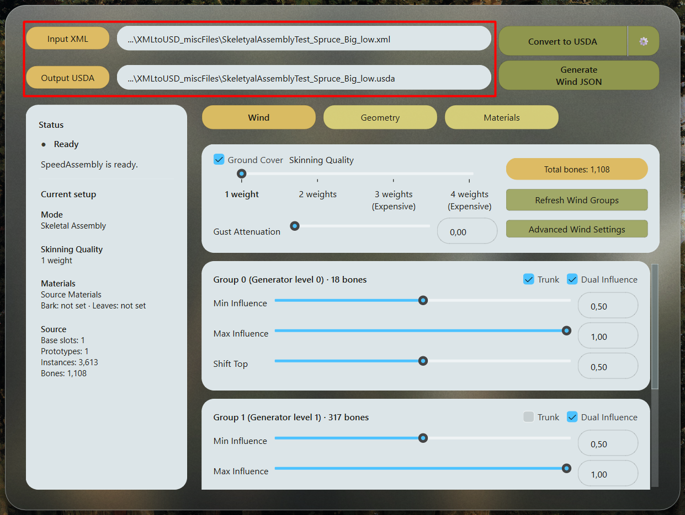
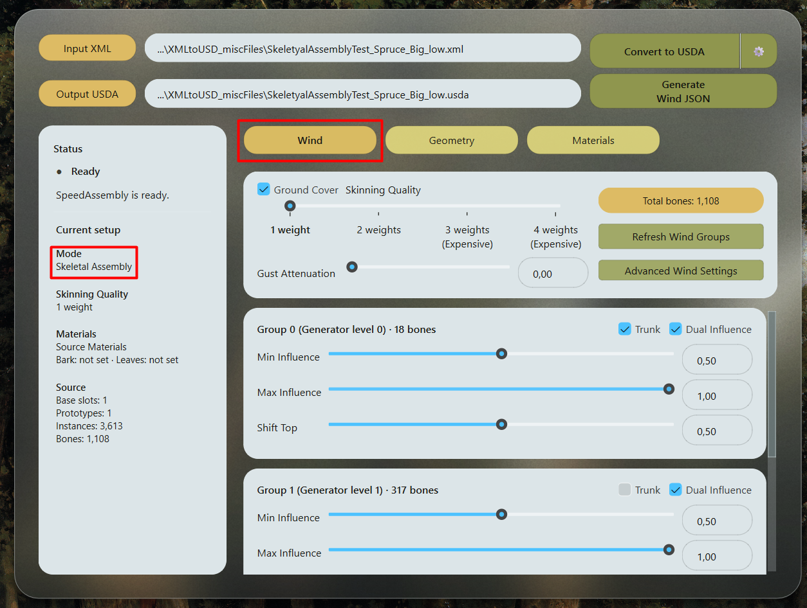
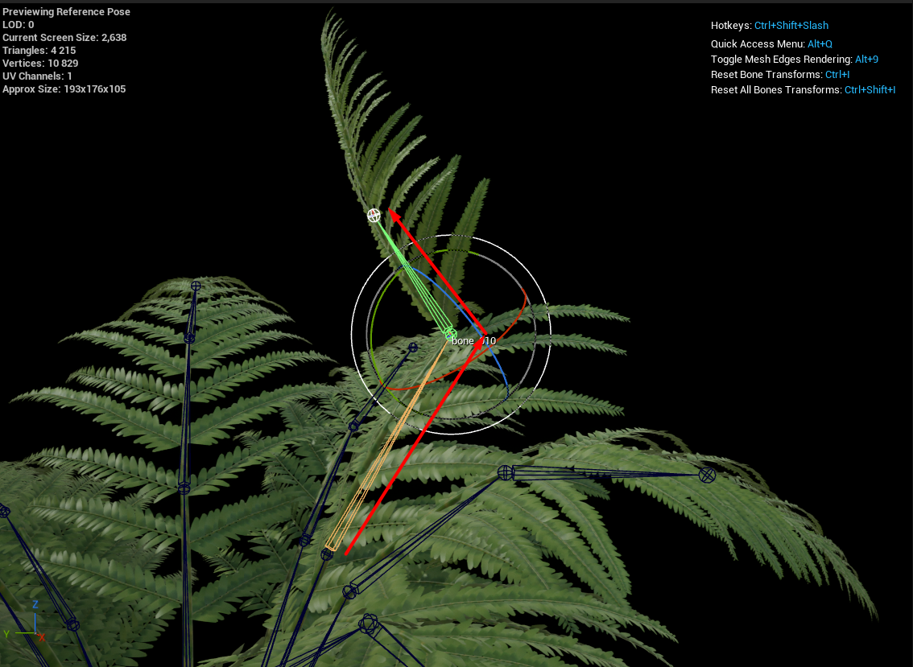
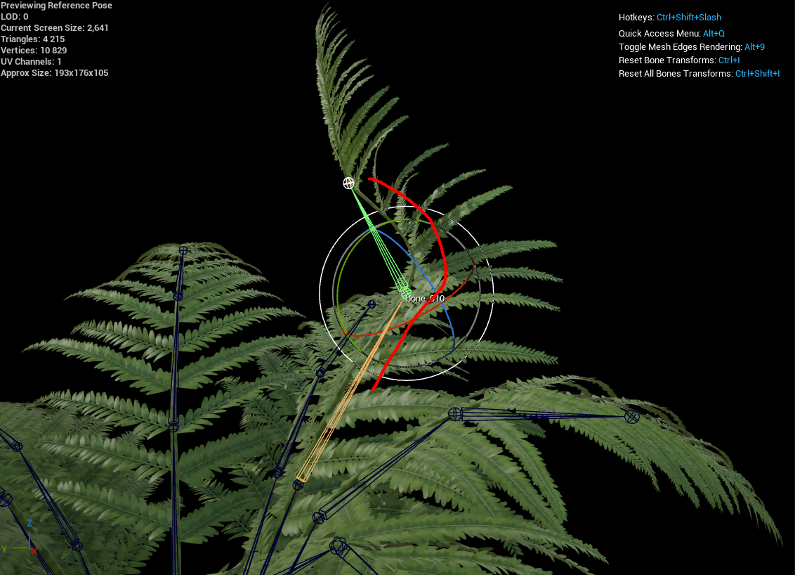
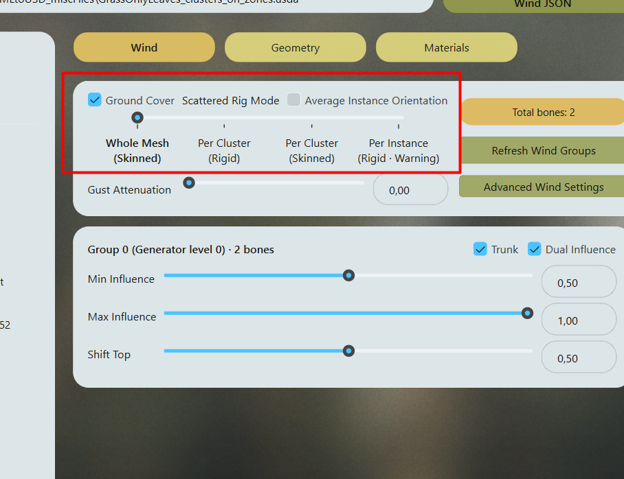
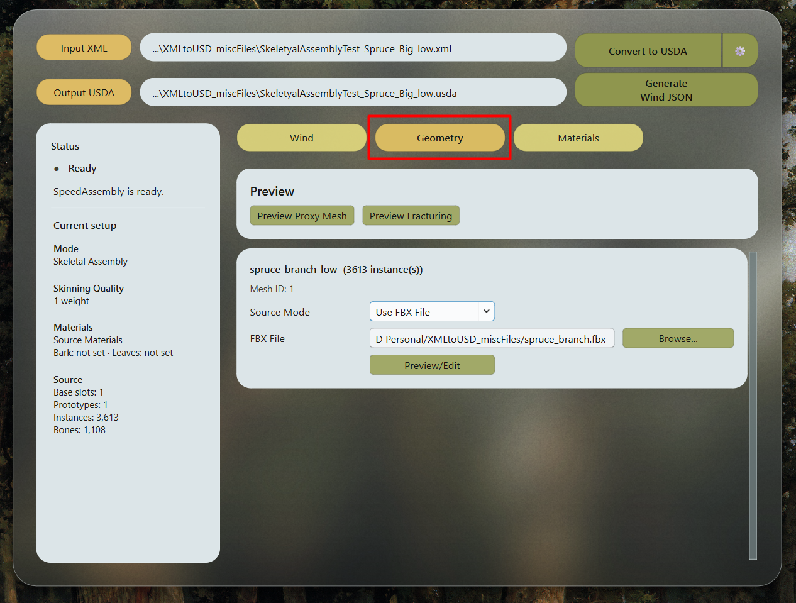
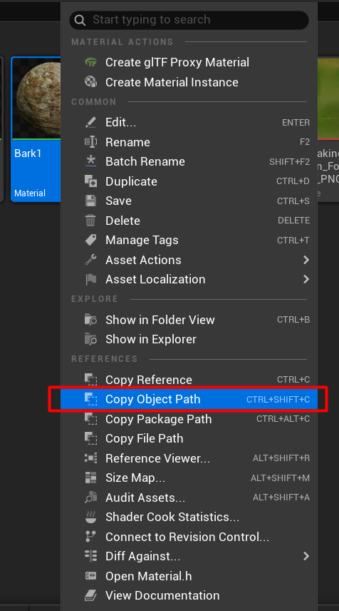
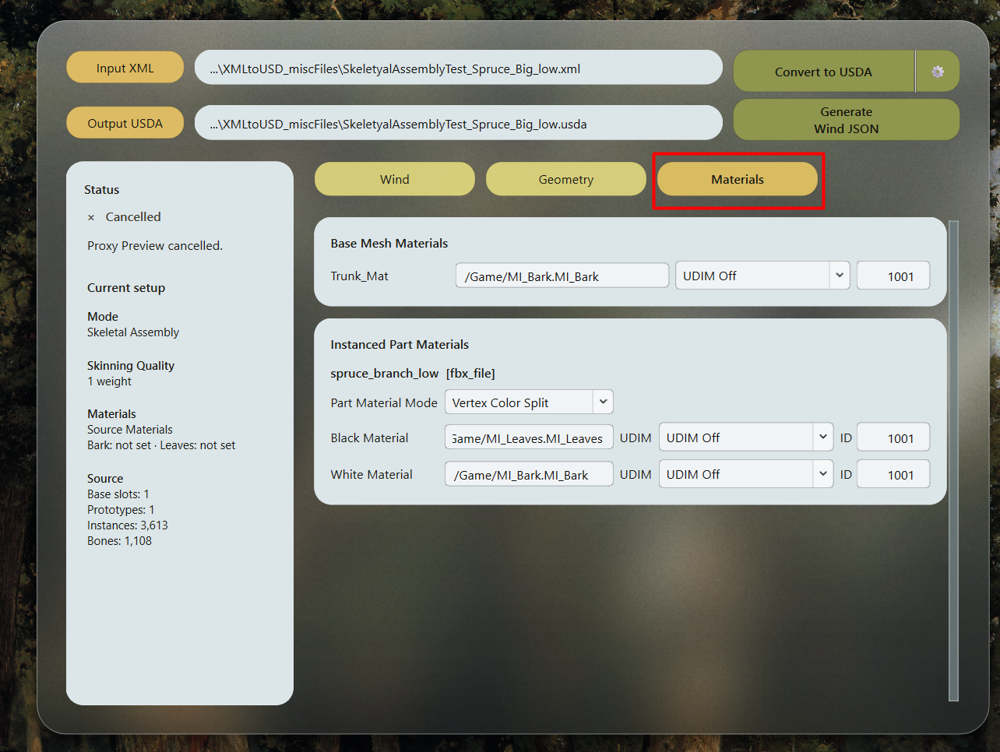
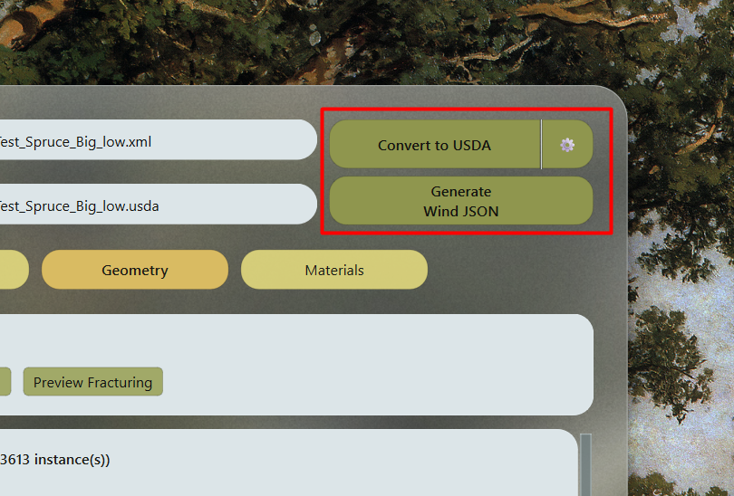

# Конвертация в SpeedAssembly {#convert-in-speedassembly}

Начните с XML, экспортированного по инструкции [Подготовка SpeedTree](prepare-speedtree.md). Проект Unreal должен быть [подготовлен к импорту](prepare-unreal.md), а нужные материалы уже должны находиться в его Content Browser.

## 1. Выберите исходный файл и путь экспорта {#1-select-the-input-and-output}

1. В SpeedAssembly нажмите **Input XML** и выберите XML из SpeedTree.
2. Проверьте **Output USDA**. По умолчанию используются папка и имя XML с расширением `.usda`.
3. При необходимости нажмите **Output USDA**, чтобы выбрать другую папку или имя файла.

SpeedAssembly автоматически анализирует файл. Во вкладках **Wind**, **Geometry** и **Materials** появятся найденные группы ветра, ветки и листья для инстансинга и material slots. Дождитесь окончания анализа перед настройкой.

## 2. Настройте Wind {#2-configure-wind}

Для растения со скелетом откройте вкладку **Wind**, чтобы выбрать способ изгиба геометрии и реакцию каждой найденной группы на ветер.

### Выберите Skinning Quality {#choose-skinning-quality}

Задайте **Skinning Quality** до конвертации:

- **1 weight** привязывает каждую вершину к одной кости. Вместо плавной дуги изгиб имеет заметные стыки сегментов. Это значение по умолчанию, самый лёгкий вариант и рекомендуемая отправная точка для деревьев.
- **2 weights** смешивает влияние костей для более плавного изгиба. Используйте, когда деформация стебля заметна, например для высокой травы или папоротника. Стыки веток стоит проверить внимательнее.
- **3 weights** и **4 weights** сохраняют больше деформации от родительских веток. Они требуют больше ресурсов во время игры и могут улучшить движение сложных стыков.

<figure style="flex: 1; min-width: 0; margin: 0;" markdown="1">

{ style="position: absolute; width: 200%; max-width: none; height: auto; left: -50%; top: -50%;" }

<figcaption>1 weight</figcaption>
</figure>
<figure style="flex: 1; min-width: 0; margin: 0;" markdown="1">

{ style="position: absolute; width: 200%; max-width: none; height: auto; left: -50%; top: -50%;" }

<figcaption>2 weights</figcaption>
</figure>

Skinning Quality определяет веса, записываемые в геометрию USDA. Эта настройка не входит в Wind JSON. Чтобы изменить её позже, заново конвертируйте растение с новым значением и повторите импорт.

### Настройте поведение групп {#set-group-behavior}

1. Проверьте найденные группы, например **Group 0**, **Group 1** и **Group 2**.
2. Отметьте группы ствола флагом **Trunk**.
3. Настройте **Influence** или включите **Dual Influence** и задайте **Min Influence**, **Max Influence** и **Shift Top**.
4. Настройте **Gust Attenuation** для реакции ствола на порывы ветра.
5. При необходимости включите **Ground Cover** для низкорослых растений.

Эти настройки групп и ветра записываются в Wind JSON, который нужно импортировать на Skeletal Mesh в Unreal. Позже их можно изменить в настройках Skeletal Mesh в Unreal. Если пока не уверены, оставьте значения по умолчанию и настройте движение уже в Unreal.

**Total bones** показывает текущее количество костей скелета. Нажмите **Refresh Wind Groups**, чтобы повторить анализ, или **Advanced Wind Settings**, чтобы проверить скелет и назначение групп в отдельном viewport.

Подробности настроек ветра описаны в [Как работает Dynamic Wind](../wiki/how-dynamic-wind-works.md).

<!-- Add Wind tab and Advanced Wind Settings procedure links when those guides exist. -->

### Растения только из инстансов листвы {#leaf-only-plants}

Если XML содержит только инстансы листвы, без base mesh и скелета, SpeedAssembly автоматически покажет **Scattered Rig Mode** вместо Skinning Quality. Также появится настройка **Average Instance Orientation**.

Доступны **Whole Mesh (Skinned)**, **Per Cluster (Rigid)**, **Per Cluster (Skinned)** и **Per Instance (Rigid)**. Для двух вариантов Per Cluster нужны найденные кластеры. Эти настройки позволяют SpeedAssembly создать скелет растения. Они не заменяют выбор режима экспорта.

<!-- Add the dedicated Scattered Rig workflow link when that guide exists. -->

## 3. Проверьте Geometry {#3-review-geometry}

Откройте **Geometry**, чтобы проверить ветки и листья для инстансинга. В каждой строке показаны mesh и количество его инстансов в растении.

Выберите **Source Mode** для каждого mesh:

- **Use XML Mesh** сохраняет геометрию из SpeedTree.
- **Use FBX File** заменяет её mesh из внешнего FBX.
- **Use Unreal Reference** использует уже импортированный mesh из Unreal.

Чтобы сослаться на импортированный элемент:

1. В **Content Browser** Unreal нажмите правой кнопкой на **Skeletal Mesh** элемента для Skeletal Assembly или на его **Static Mesh** для Static Assembly.
2. Нажмите **Copy Object Path**.
3. Во вкладке **Geometry** SpeedAssembly выберите **Use Unreal Reference** для соответствующего элемента и вставьте путь в **Unreal Path**.

Для детальных растений используйте low-poly ветки в SpeedTree, затем замените их здесь на high-poly FBX или ассеты Unreal. Pivot, ориентация и реальный размер замены должны совпадать с исходной веткой. См. [Подготовка веток и листьев для инстансинга](prepare-speedtree.md#prepare-repeated-branches-and-leaves).

Для XML и FBX mesh нажмите **Preview/Edit**, чтобы проверить ветку, при необходимости снизить polycount и назначить материалы в окне preview.

### Создайте proxy {#create-a-proxy}

Proxy рекомендуется при обычной подготовке деревьев, когда нужны коллизии, distance fields или упрощённая геометрия для теней. Он экспортируется отдельно и не обязателен для конвертации основного растения.

1. В **Geometry** нажмите **Preview Proxy Mesh**.
2. Настройте proxy и проверьте его форму.
3. Экспортируйте его из окна preview.

Настройки и порядок экспорта описаны в [Proxy Mesh](proxy-mesh.md). Для растений только из инстансов листвы со Scattered Rig генерация proxy недоступна.

**Preview Fracturing** открывает дополнительный экспериментальный workflow создания статичных частей дерева для разрушения.

<!-- Add Geometry tab, Preview/Edit, and Fracturing guide links when available. -->

## 4. Назначьте Materials {#4-assign-materials}

Перед конвертацией заполните все обязательные поля в **Base Mesh Materials** и **Instanced Part Materials**. SpeedAssembly не запускает конвертацию без нужных назначений, чтобы материалы корректно подключились при импорте.

1. В **Content Browser** Unreal нажмите правой кнопкой на нужный материал или Material Instance.
2. Нажмите **Copy Object Path**.

{ style="max-height: 550px; width: auto;" }

3. Во вкладке **Materials** SpeedAssembly вставьте путь в соответствующее поле.
4. Повторите для всех обязательных slots. Проверьте поля для выбранного **Part Material Mode**, включая **Black Material** и **White Material** для **Vertex Color Split**.

Используйте полный Object Path, например `/Game/MI_Bark.MI_Bark`. Unreal назначит эти материалы при импорте. Элементы с **Use Unreal Reference** сохраняют материалы своих существующих ассетов Unreal.

### Дополнительные настройки UDIM {#optional-udim-settings}

Выберите режим UDIM и **ID** тайла для нужного материала:

- **UDIM Off** оставляет UV без изменений.
- **Shift UV** сдвигает основной UV-канал в выбранный UDIM-тайл.
- **Write UV1 Offset** оставляет основной UV-канал без изменений и записывает смещение тайла во второй UV-канал для материала Unreal.

Выбор тайлов и граф материала Unreal для тайловой коры с данными смещения в UV1 описаны в [UDIM workflow](udim.md).

## 5. Конвертируйте геометрию и создайте данные ветра {#5-convert-geometry-and-generate-wind-data}

1. Нажмите шестерёнку рядом с **Convert to USDA** и выберите режим экспорта.

| Режим | Результат |
| --- | --- |
| **Skeletal Assembly** | Целое растение с инстансами веток и скелетом для анимации ветра. |
| **Skeletal Assembly Parts** | Отдельный файл Skeletal Mesh для каждого уникального элемента, без основной геометрии дерева. |
| **Static Assembly** | Целое растение как Static Nanite Assembly с инстансами элементов, без скелета и скелетной анимации ветра. |
| **Static Assembly Parts** | Отдельный файл Static Mesh для каждого уникального элемента, без основной геометрии дерева. |

Используйте режим Parts, чтобы сначала собрать библиотеку веток в Unreal. Затем конвертируйте целые растения с **Use Unreal Reference**, чтобы разные деревья использовали общие импортированные ветки. В режимах Parts **Create Parts Folder** сохраняет файлы в отдельную папку. Выключите его, чтобы записать их рядом с выбранным Output USDA.

2. Нажмите **Convert to USDA** и дождитесь окончания конвертации.
3. Для растения со скелетом и Dynamic Wind нажмите **Generate Wind JSON**, чтобы отдельно экспортировать настройки ветра.

Режимы целого растения создают USDA по выбранному пути. Режимы Parts создают отдельные файлы элементов. Wind JSON содержит назначение групп и настройки для Dynamic Wind в Unreal. Один только USDA не подключает данные ветра.

Далее [импортируйте ассеты и примените Wind JSON в Unreal Engine](unreal-import.md).
