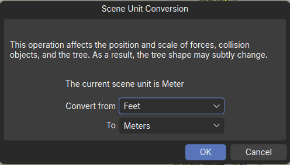
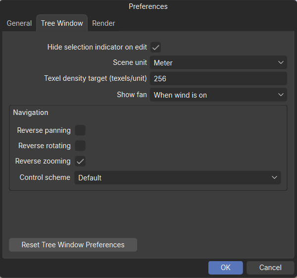
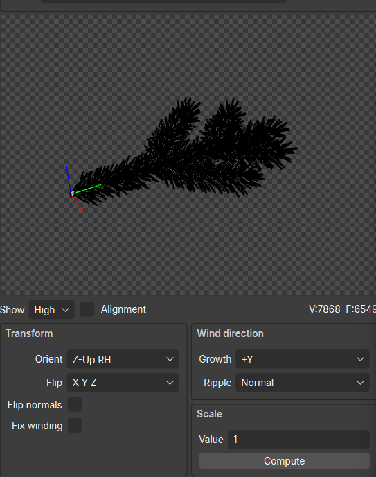
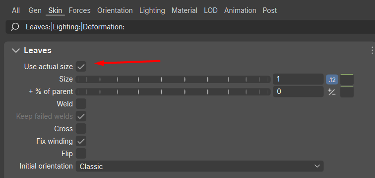
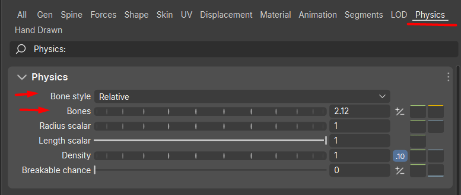
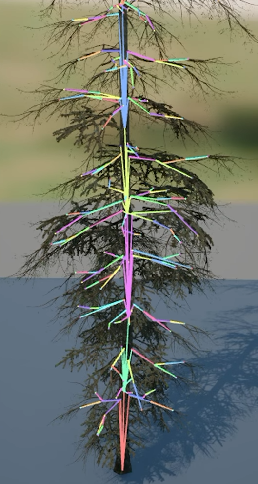
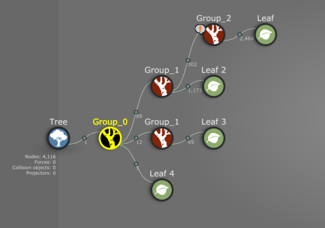
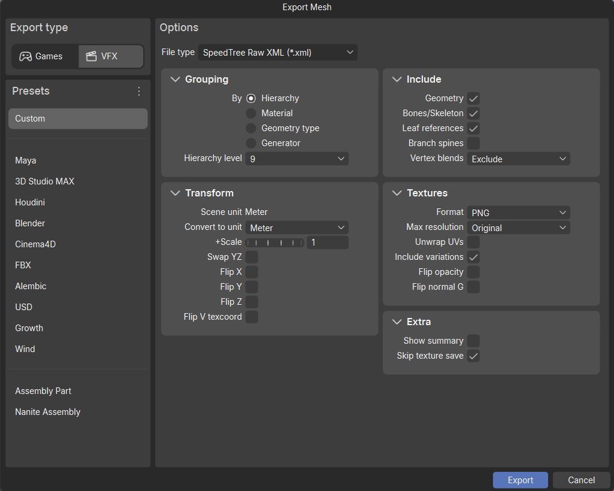
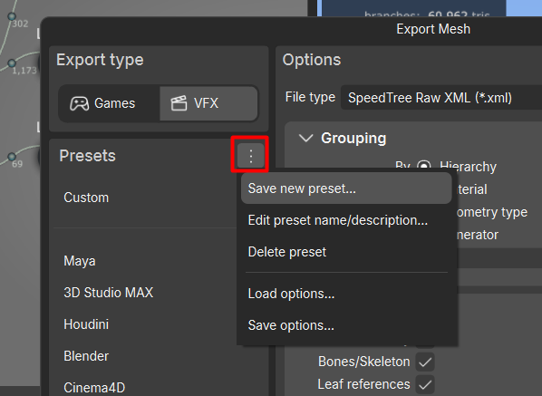

# Подготовка SpeedTree {#prepare-speedtree}

Этот workflow проверен в SpeedTree Modeler 10.0.0. Работайте в **метрах**, используйте генераторы **Leaf** для инстансов веток и листьев и добавьте **кости** в геометрию, которую нужно анимировать.

## Работайте в метрах {#work-in-meters}

1. В SpeedTree откройте **Tools > Scene Unit Conversion**.
2. Если сцена ещё не в метрах, в **Convert from** выберите её текущие единицы, а в **To** выберите **Meters**.
3. Нажмите **OK**, чтобы конвертировать сцену.

Чтобы использовать метры в новых сценах, откройте **Edit > Preferences > Tree Window** и задайте **Meter** в **Scene unit**. Эта настройка не заменяет конвертацию уже существующей сцены.

## Подготовьте ветки и листья для инстансинга {#prepare-repeated-branches-and-leaves}

Используйте генераторы **Leaf** для веток и кластеров листвы, которые Unreal будет повторять по всему растению. В этом workflow Frond и другие генераторы входят в основную геометрию, а не в инстансы элементов.

Создайте каждый mesh ветки отдельно в Blender, Maya, Houdini или другой сцене SpeedTree, затем импортируйте его в SpeedTree. Можно использовать и cutout-геометрию, но рекомендуется полностью моделировать ветки и листья.

Перед размещением проверьте подготовку mesh:

- Расположите pivot в точке крепления.
- Ориентируйте ветку так, чтобы она росла вдоль **+Y**.
- Задайте нужный реальный размер и установите **Scale > Value** импортированного mesh в **1**.

1. Выберите генератор **Leaf**.
2. Во вкладке **Material** назначьте импортированный **Mesh**.
3. Во вкладке **Skin** включите **Use actual size**.

Не импортируйте слишком большую ветку, чтобы затем компенсировать её размер крошечным Leaf size. Сначала подготовьте ветки в правильном размере, а масштаб инстансов используйте для вариаций.

Для быстрой работы в SpeedTree подготовьте low-poly и high-poly версии каждой ветки. Их pivot, ориентация и размер должны совпадать. Собирайте растение с low-poly версией, а затем замените её в SpeedAssembly на high-poly FBX или уже импортированный ассет Unreal.

## Используйте вариации, совместимые с инстансингом {#keep-variation-compatible-with-instancing}

Инстансы веток движутся вместе с костями, к которым прикреплены, но внутри не изгибаются. Leaf **Flip**, **Curl**, **Twist** и другие индивидуальные деформации mesh не сохраняются в этом workflow. Все инстансы используют одну и ту же геометрию ветки.

Меняйте ориентацию и масштаб. Для концов веток, сухих веток и других участков с особой формой используйте разные mesh.

Сохраняйте простую структуру растения: ствол, ветки и инстансы листвы. Не делайте каждую иголку отдельным инстансом. Выбирайте кластеры веток среднего размера, без крайностей в виде мелких фрагментов или целой кроны.

Подробности и лимиты сцены описаны в [Выборе геометрии для инстансинга](../wiki/choosing-assembly-parts.md).

## Добавьте кости для анимации ветра {#add-bones-for-wind-animation}

Добавьте кости в ствол и на каждый уровень веток, который нужно анимировать. Это относится и к фотограмметрическим участкам ствола, если они должны двигаться.

1. Выберите генератор ствола или веток.
2. Откройте вкладку **Physics**.
3. Выберите **Absolute** или **Relative** в **Bone style**.
4. Настройте **Bones**, чтобы у ветки было достаточно сегментов для нужного движения.

Добавьте кости на каждый уровень между стволом и самыми мелкими ветками, которые нужно анимировать. Например, если кости есть в стволе и мелких ветках, они должны быть и в соединяющих их крупных ветках.

{ style="max-height: 500px; width: auto;" }

[Скриншот из презентации CD PROJEKT RED](https://www.youtube.com/watch?v=EdNkm0ezP0o).

Используйте минимальное количество костей, с которым получается нужное движение. Это рекомендуемые бюджеты, а не лимиты движка:

| Растение | Рекомендуемый бюджет костей |
| --- | --- |
| Большое дерево | Примерно до 1,000 |
| Среднее дерево | Примерно 400–600 |
| Растение подлеска | 50–300 |
| Трава | 1–30 |

Для деревьев избегайте сегментов короче примерно 50 см, если они заметно не улучшают анимацию. Не делайте весь ствол одной длинной костью, но и не добавляйте сегменты веткам без необходимости.

Если скелет слишком подробный, сначала уменьшите количество костей на мелких ветках. Их обычно гораздо больше, чем крупных, поэтому общий счётчик костей быстро растёт.

## Назовите группы ветра {#name-wind-groups}

Группы ветра позволяют задать разное движение стволу, крупным, мелким и сухим веткам.

В графе генераторов переименуйте генераторы с костями в `Group_0`, `Group_1`, `Group_2` и так далее. Начните с `Group_0` и не пропускайте номера. Используйте одинаковое имя для генераторов, которым нужны общие настройки ветра.

Например, назначьте `Group_0` стволу, `Group_1` крупным веткам, а `Group_2` более мелким. Большинству растений хватает четырёх групп. Разделяйте группы, когда нужно разное движение, а не просто потому, что появился ещё один генератор.

SpeedAssembly читает эти группы из экспорта. Лучше назвать их здесь, но при необходимости группы можно отредактировать или создать позже в SpeedAssembly.

## Экспортируйте для SpeedAssembly {#export-for-speedassembly}

В окне **Export Mesh** точно повторите настройки со скриншота. Сохраните их в preset для следующих экспортов.

Чтобы сохранить настройки в preset:

1. Рядом с **Presets** откройте меню с тремя точками.
2. Выберите **Save new preset...** и задайте имя.

Экспортированный XML нужно выбрать в поле **Input XML** в SpeedAssembly.

Далее [конвертируйте растение в SpeedAssembly](basic-conversion.md).
