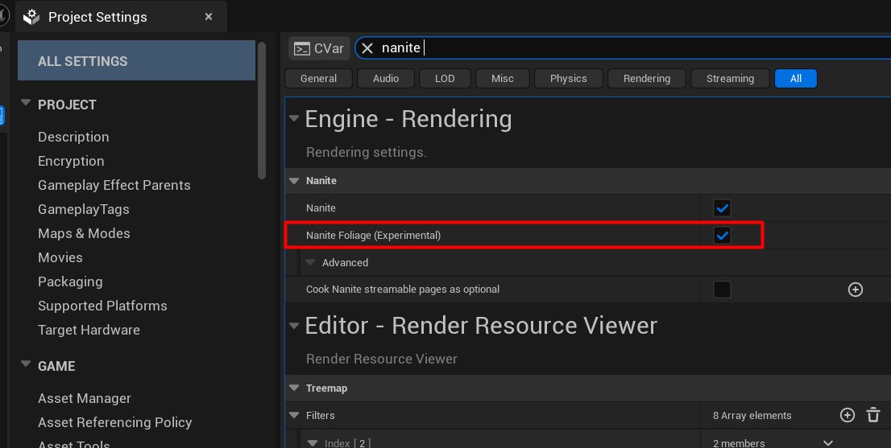
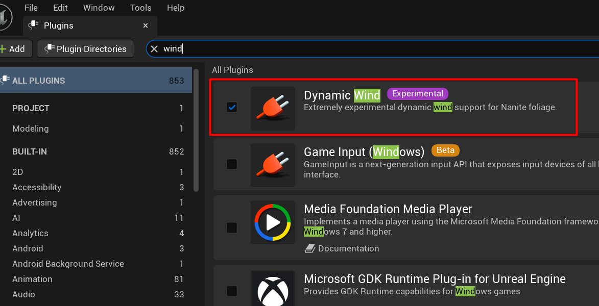
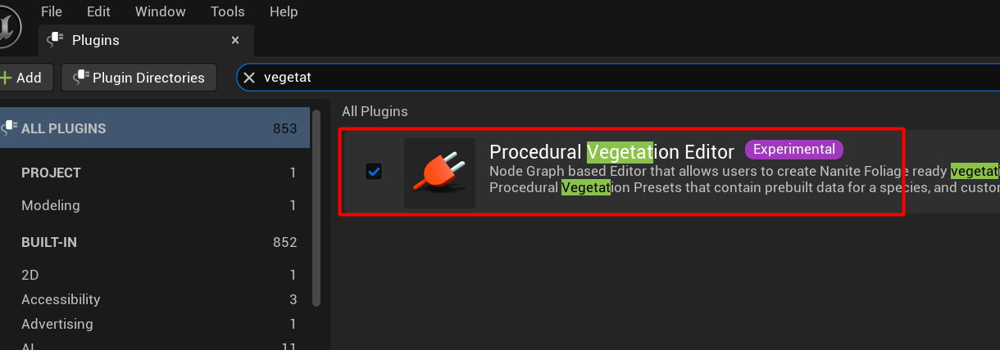
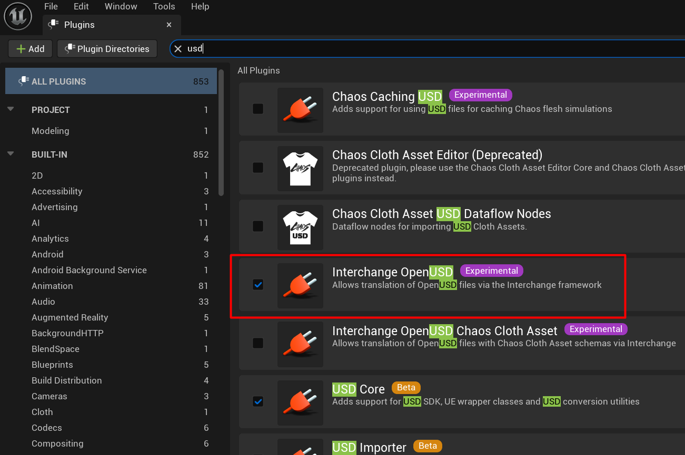

# Подготовка Unreal Engine {#prepare-unreal-engine}

SpeedAssembly поддерживает Unreal Engine 5.7 и 5.8. Описанная здесь настройка проекта одинакова для обеих версий.

Выполните эти шаги один раз для каждого проекта Unreal перед импортом растений из SpeedAssembly.

## Включите Nanite Foliage {#enable-nanite-foliage}

1. В Unreal Editor откройте **Edit > Project Settings**.
2. В поиске введите `nanite`.
3. В **Engine > Rendering > Nanite** убедитесь, что **Nanite** включён.
4. Включите **Nanite Foliage (Experimental)**.

## Включите плагины {#enable-plugins}

1. В Unreal Editor откройте **Edit > Plugins**.
2. Найдите `wind` и включите **Dynamic Wind**. Этот плагин анимирует ветер для скелетной Nanite-растительности.

    

3. Найдите `vegetation` и включите **Procedural Vegetation Editor**.

    

4. Найдите `usd` и включите **Interchange OpenUSD**. Этот плагин используется для импорта файлов из SpeedAssembly.

    

Если Unreal предложит включить зависимости плагинов, согласитесь. Эти плагины отмечены в Unreal как Experimental.

## Перезапустите и проверьте {#restart-and-check}

1. Сохраните работу и перезапустите Unreal Editor, чтобы применить настройки проекта и плагинов.
2. Снова откройте **Project Settings** и проверьте, что **Nanite Foliage (Experimental)** включён.
3. Снова откройте **Plugins** и проверьте, что **Dynamic Wind**, **Procedural Vegetation Editor** и **Interchange OpenUSD** включены.

Проект готов для SpeedAssembly workflow. Настройки импорта и подключение данных ветра описаны в отдельном руководстве по импорту в Unreal.

Далее [подготовьте растение в SpeedTree](prepare-speedtree.md).

<!-- Add the Import into Unreal Engine link when that article exists. -->
