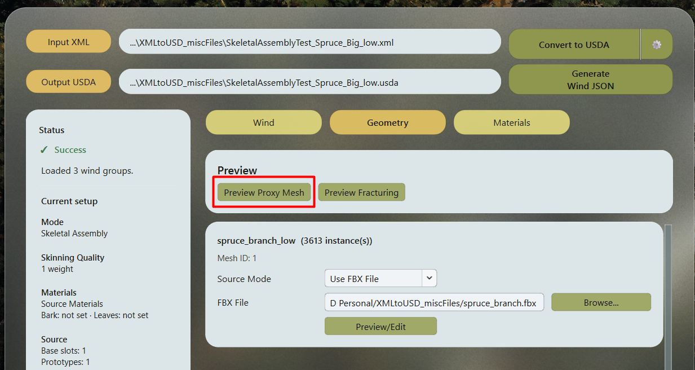
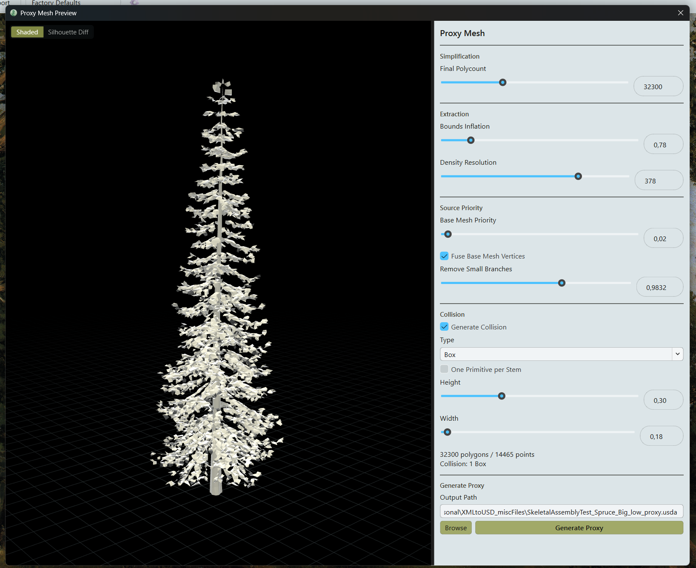

# Proxy Mesh

A Proxy Mesh is a low-poly Static Mesh that approximates the overall shape of a plant. Place it at the same transform as the visible tree to use it for distance fields, trunk collision, or simplified shadows.

## Why use a proxy?

- **Software Lumen:** Skeletal Meshes do not provide Mesh Distance Fields. A static proxy can supply a distance-field representation of the plant. [Lumen Technical Details](https://dev.epicgames.com/documentation/en-us/unreal-engine/lumen-technical-details-in-unreal-engine).
- **Collision:** A proxy can carry simple Box or Capsule collision for the trunk, independently of the wind-animated mesh and without a Physics Asset.
- **Distant shadows:** For trees away from the player, you can disable shadows on the skeletal tree and let the proxy cast a simpler static shadow. It loses wind motion in the shadow but avoids the shadow-cache invalidation caused by skeletal animation. [Virtual Shadow Maps](https://dev.epicgames.com/documentation/en-us/unreal-engine/virtual-shadow-maps-in-unreal-engine).

The proxy is a companion to the visible plant. Keep it out of the main camera view while retaining the lighting or collision contribution you need.

## Generate a proxy

1. In SpeedAssembly, select the plant's **Input XML** and check **Output USDA**.
2. Open **Geometry** and click **Preview Proxy Mesh**.

3. Wait for the mesh, then adjust **Bounds Inflation** and **Density Resolution** to capture the foliage shape.
4. Set **Final Polycount** and balance the trunk and foliage with **Base Mesh Priority**.
5. Configure **Generate Collision**, its **Type**, **Height**, and **Width** if you need trunk collision.
6. Check **Output Path** and click **Generate Proxy**.

The default output is `<OutputStem>_proxy.usda`, beside the main plant's Output USDA. You can choose another destination with **Browse** or edit the path directly. When the preview already matches the current settings, export reuses it.

Proxy generation is unavailable for leaf-only Scattered Rig input.

## Adjust the shape and polygon budget

SpeedAssembly simplifies the base mesh's trunk and unique branches separately. For repeated parts, it builds volumes from their mesh bounds, merges them into a foliage surface, and simplifies that surface. It then combines the base and foliage results into one Proxy Mesh.

**Bounds Inflation** changes the size of the repeated-part volumes. **Density Resolution** controls how finely their combined shape is captured. Raise resolution when the crown loses important structure; increasing Final Polycount cannot restore details missing from the extracted surface.

**Final Polycount** is a target triangle count, not a guaranteed exact result. **Base Mesh Priority** reserves a share of that budget for the base mesh. Lower it to leave more triangles for foliage; raise it to retain more trunk and branch shape.

Use **Remove Small Branches** to discard small disconnected pieces of the base mesh before simplification. Use **Fuse Base Mesh Vertices** when near-coincident seams between trunk sections prevent useful simplification.

## Compare the silhouette

Switch from **Shaded** to **Silhouette Diff** to compare the proxy with the original plant from the current camera:

- **Blue:** the original extends beyond the proxy.
- **Red:** the proxy extends beyond the original.
- Overlapping areas have a neutral color.

Orbit around the plant to check several views.

## Fit trunk collision

Enable **Generate Collision** and choose **Box** or **Capsule**. Adjust **Height** and **Width** to fit the trunk.

For multi-stem plants, the default is one combined primitive. Enable **One Primitive per Stem** to fit each stem separately and avoid blocking the gaps between them.

Collision fits use the original trunk geometry and skeleton, not the simplified proxy surface.

## Parameters {#parameters}

??? info "Show parameter details"

    | Control | Effect | Default / range |
    | --- | --- | --- |
    | **Final Polycount** | Target triangle count for the finished proxy. Lower values reduce detail; higher values retain more shape. The result may have fewer triangles or stop above the target when further simplification would damage topology. | 5,000; 6 to 100,000 |
    | **Bounds Inflation** | Scales the volumes built from repeated-part bounds. Lower values tighten the foliage shape; higher values expand it and can join nearby volumes. Does not inflate the base mesh. | 1.0; 0.1 to 5.0 |
    | **Density Resolution** | Voxel resolution along the longest axis of the foliage volume. Higher values capture finer structure but increase generation time and memory use. At high resolution, the surface can contain millions of triangles before simplification. | 64; 2 to 512 |
    | **Base Mesh Priority** | Share of the target budget reserved for base geometry when foliage is present. Lower values favor foliage; higher values preserve more trunk and branch geometry. | 0.33; 0 to 1 |
    | **Fuse Base Mesh Vertices** | Welds base-mesh vertices within 1 mm before simplification, after disconnected-piece removal. Helps with near-coincident seams between generator sections; does not merge separated trunks or perform a Boolean union. | Off |
    | **Remove Small Branches** | Removes a fraction of the smallest disconnected base-mesh components, ranked by size. Higher values remove more components; zero keeps all. At least one is retained. Does not cut twigs out of a continuous connected mesh. | 0.25; 0 to 1 |
    | **Generate Collision** | Adds fitted simple trunk collision to the export. Off exports only the proxy mesh. Toggling it reuses the retained collision source. | On |
    | **Type** | Chooses Box or Capsule collision. Boxes use `UBX_` guides; capsules use `UCP_` guides aligned with the fitted stem axes. | Box |
    | **One Primitive per Stem** | Off fits one primitive around the selected stems together. On fits one per stem. | Off |
    | **Height** | Fraction of the main stem axes covered upward from their base, rather than a fraction of the proxy's overall bounds. Zero omits collision. | 0.5; 0 to 1 |
    | **Width** | Multiplies the automatically fitted trunk width. One keeps the fitted width; zero omits collision. Fitting excludes unrelated crown geometry. | 1.0; 0 to 10 |
    | **Shaded / Silhouette Diff** | Switches between the normal preview and the geometric silhouette comparison. This display choice does not affect export. | Shaded |
    | **Output Path** | Exact USDA destination. Defaults to `<OutputStem>_proxy.usda` beside the main output; a custom path receives no extra suffix. | Derived from Output USDA |
    | **Browse** | Chooses the proxy output destination. | |
    | **Generate Proxy** | Writes the current mesh and collision settings. Reuses a matching completed preview; otherwise generates the requested mesh first. | |

## Import into Unreal

Drag the Proxy USDA into the Content Browser using the settings in [Import into Unreal Engine](unreal-import.md). It imports as a Static Mesh, with simple collision when exported and **Import Collisions** is enabled.

Place the proxy with the same location, rotation, and scale as the tree. For a shadow proxy, disable the tree's **Cast Shadow** and enable it on the proxy.

## Viewport navigation

- Left mouse button: orbit.
- Middle mouse button: pan.
- Mouse wheel: zoom.
- Double-click the mesh: focus the clicked region.
- `F`: frame the whole plant.
