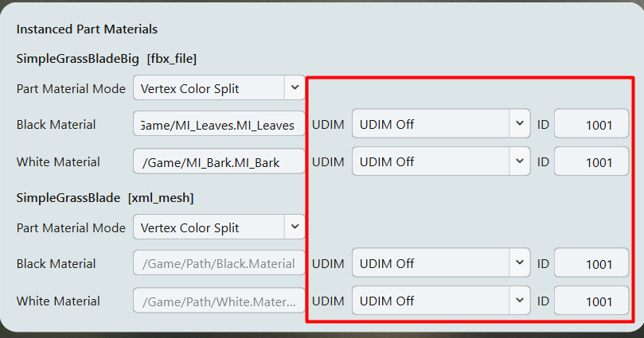
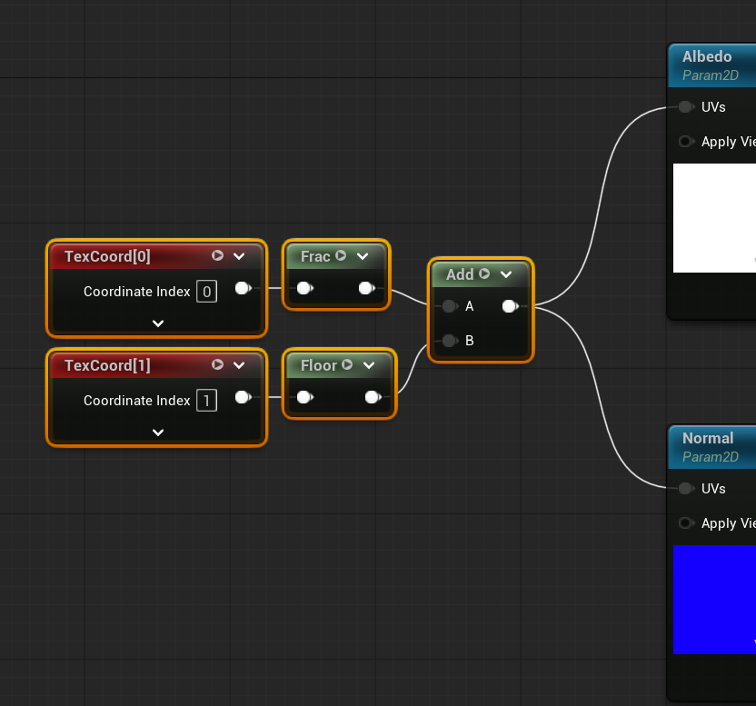

# UDIM workflow {#udim-workflow}

В **Materials** задайте режим UDIM и **ID** тайла для каждого назначения материала. Для инстансов элементов те же настройки доступны в **Geometry > Preview/Edit**.

## Зачем использовать UDIM? {#why-use-udims}

UDIM позволяет объединить текстурные атласы веток, тайловую кору и другие текстуры растений в одну большую virtual texture. Разные растения смогут использовать общий материал с этим атласом вместо отдельных Material Instance с разными текстурами для каждого растения. Это уменьшает количество разных материалов в Nanite-растительности.

Unreal импортирует набор UDIM-изображений как ассет Virtual Texture. Сначала подготовьте текстуры и материал в Unreal, включив virtual texturing и совместимые texture samplers. SpeedAssembly назначает тайлы через UV-данные. Он не упаковывает атлас и не создаёт материал. Настройка текстур описана в [руководстве Epic по Streaming Virtual Texturing](https://dev.epicgames.com/documentation/unreal-engine/streaming-virtual-texturing-in-unreal-engine?lang=en-US).

## Выберите режим и тайл {#select-a-mode-and-tile}

1. В SpeedAssembly откройте **Materials** и найдите нужный материал base mesh или инстансов элементов.
2. Назначьте Object Path материала Unreal.
3. Выберите **Shift UV** или **Write UV1 Offset** в выпадающем списке UDIM.
4. Установите **ID** тайла с нужной текстурой, например `1002`.



Для элемента можно также открыть **Geometry > Preview/Edit**, задать тот же материал и настройки UDIM и нажать **Apply**.

**UDIM Off** оставляет UV без изменений. Два других режима требуют разной настройки UV в материале.

## Shift UV {#shift-uv}

Используйте **Shift UV** для UV в квадрате `0–1`, например для mesh листа. Этот квадрат соответствует UDIM-тайлу `1001`. SpeedAssembly сдвигает UV на смещение выбранного тайла, сохраняя их форму и масштаб.

Например, выбор `1002` добавляет единицу к U и оставляет V без изменений. В Unreal подключите **TexCoord[0]** напрямую ко входу **UVs** у UDIM Texture Sample.

Этот режим не создаёт тайлинг внутри одного тайла. UV за пределами тайла могут обратиться к соседним тайлам. Для тайловой коры используйте **Write UV1 Offset**.

## Write UV1 Offset {#write-uv1-offset}

Используйте **Write UV1 Offset**, когда основной UV-канал должен тайлиться, например для коры вдоль ствола. Не нужно разрезать mesh на секции только ради размещения UV внутри `0–1`.

SpeedAssembly сохраняет **UV0** и записывает смещение выбранного тайла в **UV1**, второй UV-канал. Материал Unreal заворачивает UV0 в `0–1`, затем добавляет смещение тайла из UV1. Кора тайлится по mesh, а каждое повторение читает один и тот же UDIM-тайл.

!!! note "Оставьте UV1 для данных тайла"

    Этот режим заменяет существующие данные UV1. Не используйте канал для других целей и не перезаписывайте его при импорте.

### Соберите UV в материале {#build-the-material-uvs}

В Material Editor Unreal:

1. Подключите **TexCoord[0]** к **Frac**.
2. Подключите **TexCoord[1]** к **Floor**.
3. Подключите оба результата к **Add**.
4. Подключите **Add** ко входу **UVs** у UDIM texture samples.



Эквивалентное выражение HLSL:

```hlsl
float2 sampleUV = frac(UV0) + floor(UV1);
```

**Frac** повторяет основной UV-канал внутри тайла. **Floor** извлекает смещение тайла из UV1. Используйте один и тот же результат для текстурных карт с этой UDIM-развёрткой.

Этот граф предназначен именно для **Write UV1 Offset**. Frac удаляет смещение тайла из UV0, созданного режимом **Shift UV**. Если кора и листва используют один материал с таким графом, выбирайте **Write UV1 Offset** для обоих, чтобы UV1 задавал правильный тайл.

## Как SpeedAssembly записывает UV {#uv-formula}

Нумерация UDIM начинается с `1001`, в каждой строке десять столбцов. Пример в стиле HLSL ниже соответствует расчёту смещения в конвертере для допустимого ID тайла:

```hlsl
int tileIndex = udimId - 1001;
float2 tileOffset = float2(tileIndex % 10, tileIndex / 10);

// Shift UV: write the shifted coordinates to UV0.
float2 shiftedUV0 = UV0 + tileOffset;

// Write UV1 Offset: keep UV0 and write these coordinates to UV1.
float2 encodedUV1 = tileOffset + float2(0.5, 0.5);
```

Для тайла `1012` смещение равно `(1, 1)`, а записанное значение UV1 равно `(1.5, 1.5)`. Floor в материале извлекает из него `(1, 1)`. Добавленные `0.5` помещают значение в центр тайла, подальше от целочисленных границ.

## Конвертируйте и проверьте {#convert-and-check}

Конвертируйте растение и [импортируйте его в Unreal](unreal-import.md). Проверьте, что каждая поверхность читает нужный тайл, а кора тайлится без перехода к другой текстуре. Если тайл выбран неправильно, сначала сравните **ID** с настройкой UV в материале, а затем меняйте mesh.

Назначение материалов и остальные шаги экспорта описаны в [Конвертации в SpeedAssembly](basic-conversion.md#4-assign-materials).
