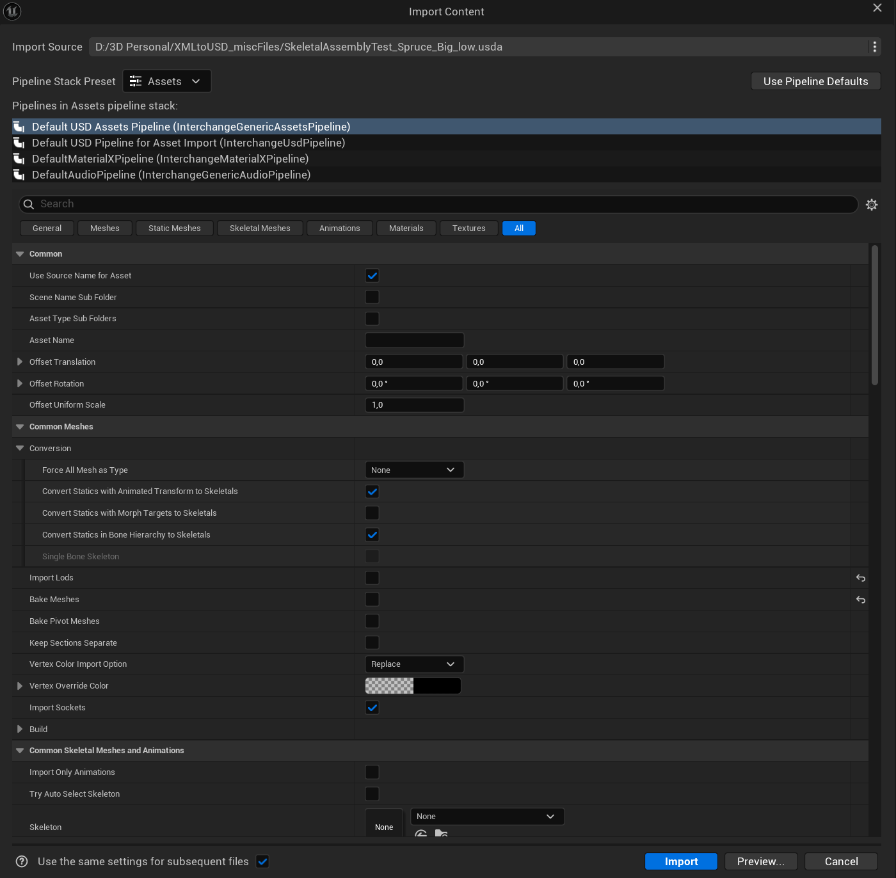
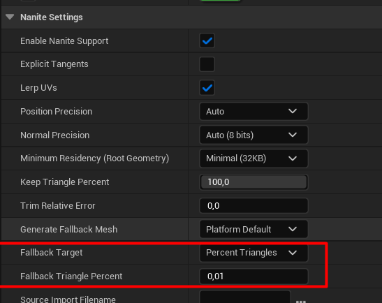
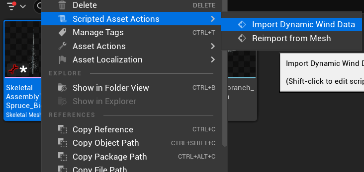
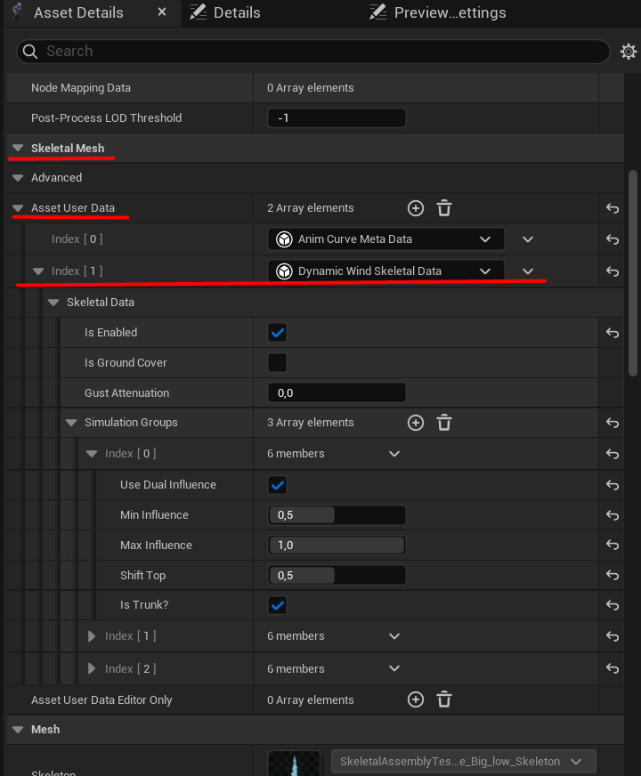
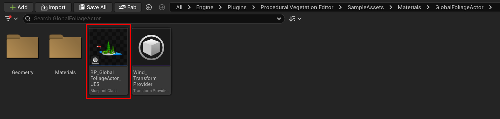
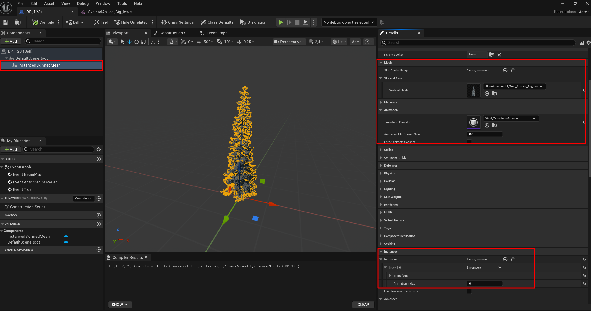
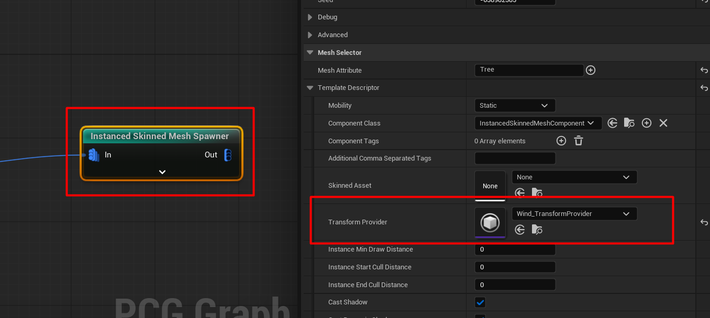

# Импорт в Unreal Engine {#import-into-unreal-engine}

Перед импортом выполните [Подготовку Unreal Engine](prepare-unreal.md). Нужные плагины и Nanite Foliage должны быть включены. Подготовьте экспортированный USDA и, для растения со скелетом, соответствующий Wind JSON.

## 1. Импортируйте USDA {#1-import-the-usda}

1. В **Content Browser** Unreal откройте папку для ассетов растения.
2. Перетащите экспортированный `.usda` в эту папку. Откроется окно Interchange **Import Content**.
3. Выберите **Default USD Assets Pipeline** и задайте настройки из таблиц.

{ style="max-height: 700px; width: auto;" }

### Common {#common}

| Настройка | Значение |
| --- | --- |
| Scene Name Sub Folder | Off |
| Asset Type Sub Folders | Off |

### Common Meshes {#common-meshes}

| Настройка | Значение |
| --- | --- |
| Force All Mesh as Type | None |
| Import Lods | Off |
| Bake Meshes | Off |
| Recompute Normals | Off |

### Common Skeletal Meshes and Animations {#common-skeletal-meshes-and-animations}

| Настройка | Значение |
| --- | --- |
| Import Only Animations | Off |
| Try Auto Select Skeleton | Off |
| Skeleton | None |

!!! warning "Проверяйте Skeleton перед каждым импортом"

    Не используйте Skeleton другого дерева. Unreal может автоматически выбрать существующий Skeleton при импорте в папку со скелетными ассетами. Очистите поле до **None**, чтобы растение получило собственный Skeleton.

### Static Meshes {#static-meshes}

| Настройка | Значение |
| --- | --- |
| Import Static Meshes | On |
| Import Collisions | On |
| Build Nanite | On |

Оставьте импорт Static Mesh включённым даже для растения со скелетом. Эти же настройки подойдут для Static Assembly, отдельных статичных элементов и Proxy Mesh. **Import Collisions** позволяет импортировать подготовленные коллизии proxy.

### Skeletal Meshes {#skeletal-meshes}

| Настройка | Значение |
| --- | --- |
| Import Skeletal Meshes | On |
| Import Morph Targets | Off |
| Create Physics Asset | Off |

Dynamic Wind не требует Physics Asset и animation clips. Отключите их создание, чтобы не добавлять лишние ассеты в Content Browser. Morph targets в этом workflow не используются.

### Animations, материалы и другие типы ассетов {#animations-materials-and-other-asset-types}

| Раздел | Настройка | Значение |
| --- | --- | --- |
| Animations | Import Animations | Off |
| Materials | Import Materials | On |
| Textures | Import Textures | Off |
| Sparse Volume Textures | Import Sparse Volume Textures | Off |
| Grooms | Enable Groom Types Import | Off |

Оставьте **Import Materials** включённым, чтобы Interchange прочитал назначения материалов из USDA. Материалы Unreal, указанные в SpeedAssembly, уже должны существовать в проекте.

Остальные настройки оставьте без изменений. Unreal запоминает настройки pipeline для следующих импортов, но всегда проверяйте **Skeleton** и выбранный pipeline. **Use the same settings for subsequent files** применяет текущие настройки к следующим файлам в рамках этой операции импорта.

4. Нажмите **Import** и дождитесь окончания компиляции mesh и Nanite.

## 2. Проверьте импортированные ассеты {#2-check-the-imported-assets}

Результат зависит от режима экспорта:

| Режим экспорта | Ожидаемые ассеты |
| --- | --- |
| Skeletal Assembly | Целое растение как Skeletal Mesh с его Skeleton, плюс каждый экспортированный элемент как Skeletal Mesh со своим Skeleton. |
| Static Assembly | Базовая геометрия и экспортированные элементы как Static Mesh, плюс собранное растение как Static Mesh Nanite Assembly. |
| Skeletal Assembly Parts | Отдельные скелетные элементы и их Skeleton, без собранного дерева. |
| Static Assembly Parts | Отдельные Static Mesh элементы, без собранного дерева. |

Элементы с **Use Unreal Reference** используют указанные ассеты без создания новых копий. Полностью запечённые экспорты Scattered Rig импортируются как обычные Skeletal Mesh, а не Assembly с отдельными элементами.

Откройте итоговое растение и проверьте его размер, ориентацию и материалы. Для Assembly проверьте ссылки на элементы в **Nanite Assembly References** внутри **Nanite Settings**.

### Fallback для Static Assembly в UE 5.7 {#static-assembly-fallback-in-ue-57}

В UE 5.7 Static Assembly может создать fallback mesh с геометрией всего дерева. Для high-poly дерева такой fallback получается слишком большим и долго собирается.

Чтобы уменьшить слишком большой fallback:

1. Откройте итоговый ассет Static Mesh Assembly.
2. В **Nanite Settings** задайте **Percent Triangles** для **Fallback Target**.
3. Уменьшите **Fallback Triangle Percent**, примените изменения и дождитесь пересборки mesh.

В проверенном UE 5.8 workflow такая ручная корректировка не потребовалась.

Очень низкий процент на скриншоте приведён как пример, а не универсальная настройка. Перед выбором итогового значения проверьте пересобранный fallback для своей задачи.

### Импортируйте proxy {#import-a-proxy}

Перетащите отдельно экспортированный Proxy USDA в нужную папку Content Browser с теми же настройками импорта. Он импортируется как Static Mesh. Проверьте наличие подготовленных simple collision. Генерация и использование описаны в [Proxy Mesh](proxy-mesh.md).

## 3. Импортируйте Wind JSON {#3-import-wind-json}

Для статичных экспортов пропустите этот шаг.

1. В **Content Browser** нажмите правой кнопкой на **Skeletal Mesh** итогового растения, а не на его Skeleton или отдельную ветку.
2. Выберите **Scripted Asset Actions > Import Dynamic Wind Data**.
3. Выберите соответствующий Wind JSON из SpeedAssembly.

4. Откройте Skeletal Mesh. В **Asset Details** разверните **Skeletal Mesh > Asset User Data** и найдите **Dynamic Wind Skeletal Data**.
5. Проверьте, что **Is Enabled** включён, затем разверните **Simulation Groups** и сравните значения с настройками SpeedAssembly.
6. Сохраните Skeletal Mesh.

{ style="max-height: 650px; width: auto;" }

После импорта здесь можно изменить реакцию групп на ветер. Эти настройки управляют движением костей. Используйте JSON от того же растения и скелета. Файл другого дерева может неправильно назначить группы.

### При необходимости сохраните форму {#optional-shape-preservation}

Если листва сильно теряет площадь или объём на расстоянии, в **Nanite Settings** mesh выберите **Preserve Area** или **Voxelize** для **Shape Preservation**. Сравните результат в своей сцене. Это настройка визуального качества, она не обязательна для Dynamic Wind.

## 4. Найдите ассеты ветра {#4-find-the-wind-assets}

Примеры ассетов ветра входят в **Procedural Vegetation Editor**, который вы включили при подготовке проекта.

1. В настройках **Content Browser** включите **Show Engine Content** и **Show Plugin Content**, если ассеты плагина скрыты.
2. Откройте **Procedural Vegetation Editor > SampleAssets > Materials > GlobalFoliageActor**.

Здесь находятся **Wind_TransformProvider** и **BP_GlobalFoliageActor_UE5**. Назначьте provider компонентам, отображающим растения со скелетом.

!!! warning "Назначьте Transform Provider до генерации растительности"

    В этом Dynamic Wind workflow всегда назначайте **Wind_TransformProvider** компоненту или PCG spawner до создания инстансов. Импорт Wind JSON на mesh не настраивает его компонент. Без provider Dynamic Wind не будет анимировать инстансы.

## 5. Проверьте одно растение в Blueprint {#5-test-one-plant-in-blueprint}

Для проверки ветра используйте компонент **Instanced Skinned Mesh**. Обычный Skeletal Mesh Actor использует другую схему.

1. Создайте Actor Blueprint и добавьте компонент **Instanced Skinned Mesh**.
2. В **Details** компонента назначьте итоговое растение в **Skeletal Mesh**.
3. В **Animation** задайте **Wind_TransformProvider** для **Transform Provider**.
4. В **Instances** добавьте один элемент массива. Для первой проверки оставьте rotation и location нулевыми, а scale равным единице.
5. Скомпилируйте и сохраните Blueprint, затем поместите его на уровень.

### Используйте растение в PCG {#use-the-plant-in-pcg}

1. В графе PCG используйте **Instanced Skinned Mesh Spawner**.
2. Задайте **Mesh Attribute** как атрибут, содержащий путь к Skeletal Mesh растения.
3. В **Template Descriptor** задайте **Wind_TransformProvider** для **Transform Provider** до генерации графа.

Назначьте provider до генерации графа, даже если планируете настроить ветер позже. Без него skeleton batching отключается, и Unreal выделяет буферы скелета отдельно для компонентов вместо совместного использования. Плотная растительность может превысить лимиты смещений в буферах и вызвать crash с assertion в `SkinningSceneExtension.h`. Этот crash подтверждён в UE 5.7. Назначение **Wind_TransformProvider** восстановило batching и устранило его. В UE 5.8 тот же риск выделения буферов сохраняется по результатам проверки исходников, хотя сам crash там не воспроизведён. Provider нужен для Dynamic Wind в обеих версиях.

## 6. Управляйте ветром на уровне {#6-control-the-wind-in-the-level}

Перетащите **BP_GlobalFoliageActor_UE5** из папки примеров на уровень. Проверьте реакцию растения через его настройки ветра. Позже можно использовать этот Blueprint как основу собственного контроллера, при необходимости добавив управление Wind Amplitude.

!!! tip "World Partition"

    Отключите **Is Spatially Loaded** в настройках **World Partition** глобального контроллера ветра, чтобы streaming по расстоянию до камеры не выгружал его. Также оставьте его Data Layer включённым. Streaming этого контроллера уже вызывал crashes в Unreal. Он должен оставаться загруженным, пока растительность использует Dynamic Wind.

Сохраните контроллер и Blueprint растения. Убедитесь, что растение движется от ветра, материалы назначены правильно, ветки и листва не пропадают. Проверьте несколько копий с планируемой плотностью размещения перед заполнением уровня.

Настройки реакции и диагностика движения описаны в [Как работает Dynamic Wind](../wiki/how-dynamic-wind-works.md), а бюджеты трансформаций Assembly в [Выборе геометрии для инстансинга](../wiki/choosing-assembly-parts.md).
